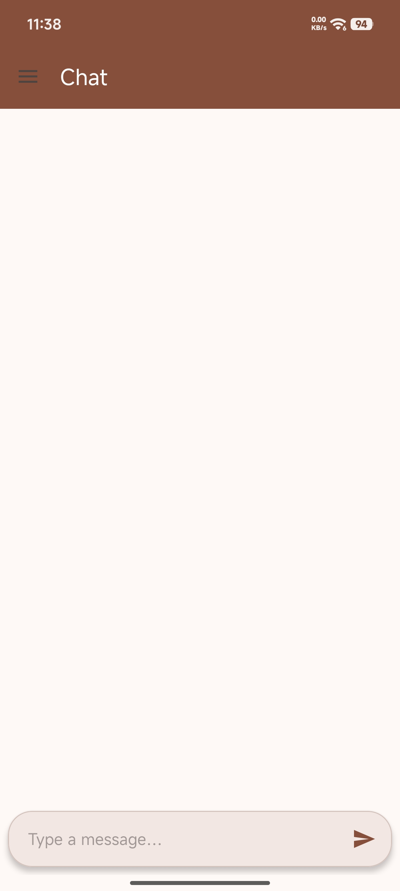
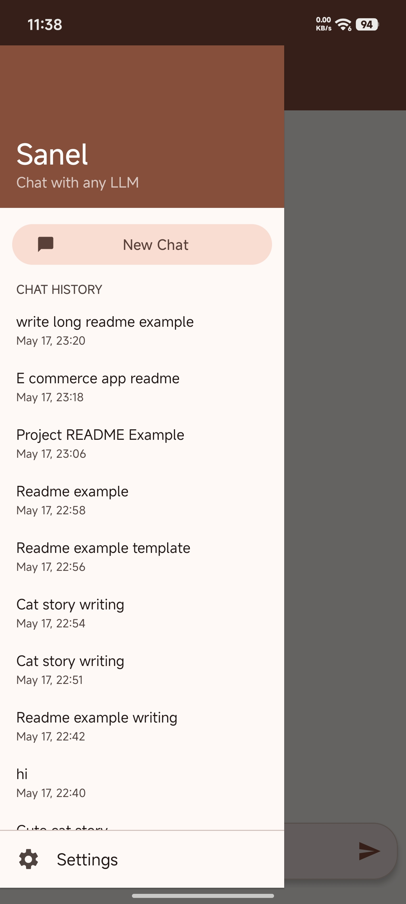
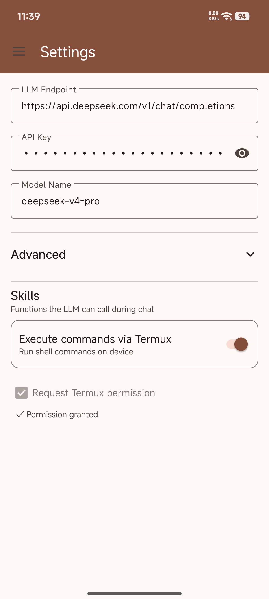

# Sanel

<p align="center">
  
  
  
  
  
</p>

**Sanel** is an Android chat application powered by LLM (Large Language Model) APIs with native Termux integration for executing shell commands. It features Material You dynamic theming, conversation history, streaming responses, and tool calling capabilities.

## Features

- **🤖 LLM Chat** — Connect to any OpenAI-compatible API endpoint (DeepSeek, OpenAI, LongCat, etc.)
- **⚡ Streaming Responses** — Real-time token-by-token streaming with markdown rendering
- **🖥️ Termux Integration** — Execute shell commands directly from chat via Termux RUN_COMMAND intent
- **💬 Conversation History** — Save, load, and manage multiple conversations
- **🎨 Material You** — Dynamic color theming based on system wallpaper/accent
- **🛠️ Tool Calling** — Automatic function calling for command execution with guardrails
- **📋 Command Collapse** — Expandable command output panels with auto-generated labels
- **🌙 Dark Theme** — Full Material 3 dark theme support

## Screenshots

<p align="center">
  
  
  
</p>

## Prerequisites

- Android 7.0+ (API 24)
- [Termux](https://termux.com/) (for shell command execution)
- An API key from an OpenAI-compatible LLM provider

## Installation

Download the latest APK from the [Releases](https://github.com/fahrulseptiana/sanel/releases) page or build from source.

## Setup

1. Install and open the app
2. Go to **Settings** — configure your API endpoint, API key, and model
3. Enable **Termux integration** and grant the `RUN_COMMAND` permission when prompted
4. Start chatting! The app will automatically use tool calls for shell commands

### Default Settings

- **Endpoint**: `https://api.deepseek.com/v1/chat/completions`
- **Model**: `deepseek-v4-flash`
- **Max Tokens**: 200,000

## Building from Source

```bash
git clone https://github.com/fahrulseptiana/sanel.git
cd sanel
./gradlew assembleDebug
```

The debug APK will be at `app/build/outputs/apk/debug/app-debug.apk`.

## Project Structure

```
app/src/main/java/id/fahrul/sanel/
├── ChatAdapter.kt          # RecyclerView adapter with DiffUtil, markdown rendering
├── ChatFragment.kt          # Main chat UI with keyboard handling, scrolling
├── ChatHistoryAdapter.kt    # Drawer conversation list adapter
├── ChatMessage.kt           # Message data model
├── ChatViewModel.kt         # ViewModel — state, streaming, guardrails, auto-title
├── ConversationManager.kt   # Conversation persistence (SharedPreferences)
├── BuildInfo.kt             # System prompt builder with Termux guidance
├── LLMClient.kt             # OkHttp-based SSE streaming client
├── MainActivity.kt          # Drawer navigation, history management
├── SettingsFragment.kt      # Settings UI (endpoint, API key, model, Termux)
├── SettingsManager.kt       # SharedPreferences wrapper
├── ToolExecutor.kt          # Termux RUN_COMMAND intent execution
```

## Tech Stack

- **Kotlin** — 100% Kotlin codebase
- **Jetpack** — ViewModel, Navigation, LiveData/Flow, Material 3
- **OkHttp** — HTTP client for SSE streaming
- **Gson** — JSON serialization
- **Markwon** — Markdown rendering in chat bubbles
- **RecyclerView** — Efficient list rendering with DiffUtil
- **Gradle** — Version catalog with AGP 8.2.2

## License

MIT License

Copyright (c) 2026 Fahrul Septiana

Permission is hereby granted, free of charge, to any person obtaining a copy
of this software and associated documentation files (the "Software"), to deal
in the Software without restriction, including without limitation the rights
to use, copy, modify, merge, publish, distribute, sublicense, and/or sell
copies of the Software, and to permit persons to whom the Software is
furnished to do so, subject to the following conditions:

The above copyright notice and this permission notice shall be included in all
copies or substantial portions of the Software.

THE SOFTWARE IS PROVIDED "AS IS", WITHOUT WARRANTY OF ANY KIND, EXPRESS OR
IMPLIED, INCLUDING BUT NOT LIMITED TO THE WARRANTIES OF MERCHANTABILITY,
FITNESS FOR A PARTICULAR PURPOSE AND NONINFRINGEMENT. IN NO EVENT SHALL THE
AUTHORS OR COPYRIGHT HOLDERS BE LIABLE FOR ANY CLAIM, DAMAGES OR OTHER
LIABILITY, WHETHER IN AN ACTION OF CONTRACT, TORT OR OTHERWISE, ARISING FROM,
OUT OF OR IN CONNECTION WITH THE SOFTWARE OR THE USE OR OTHER DEALINGS IN THE
SOFTWARE.
